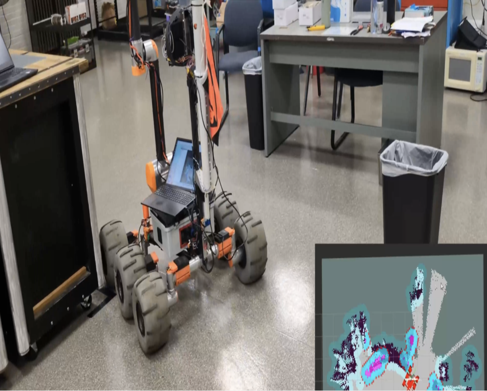
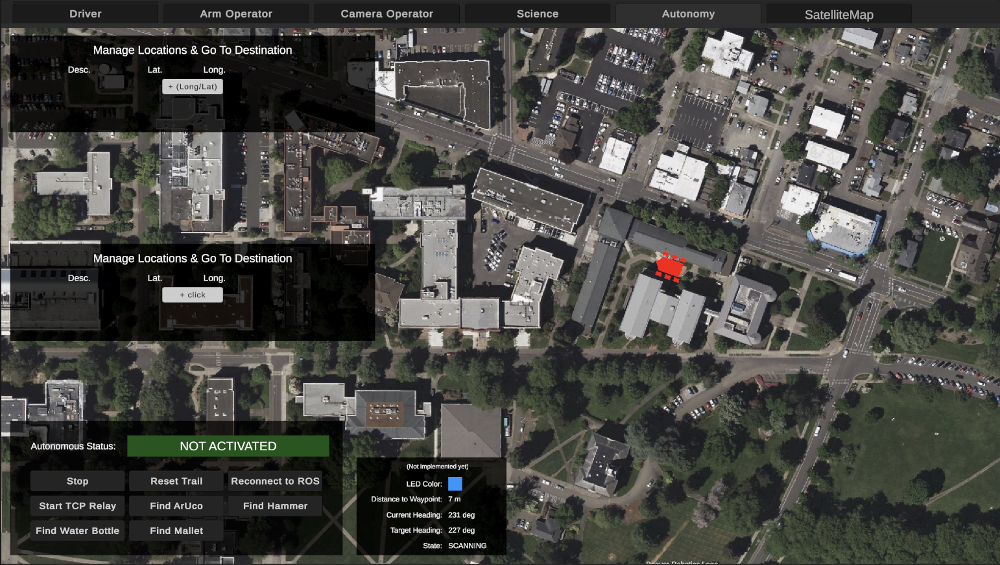
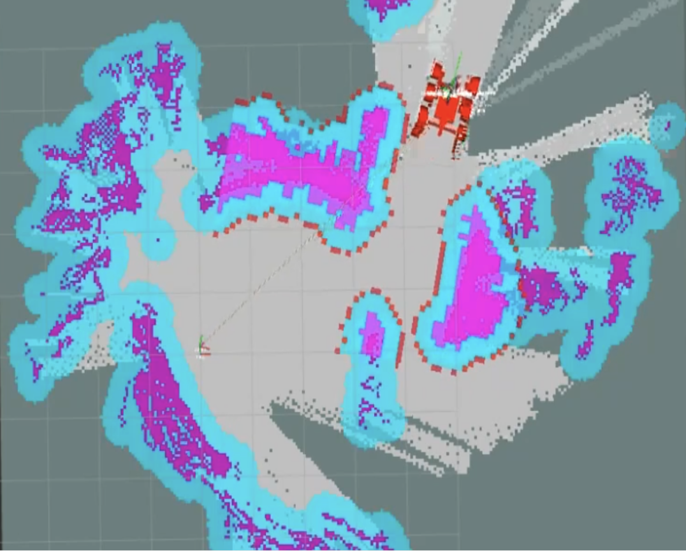
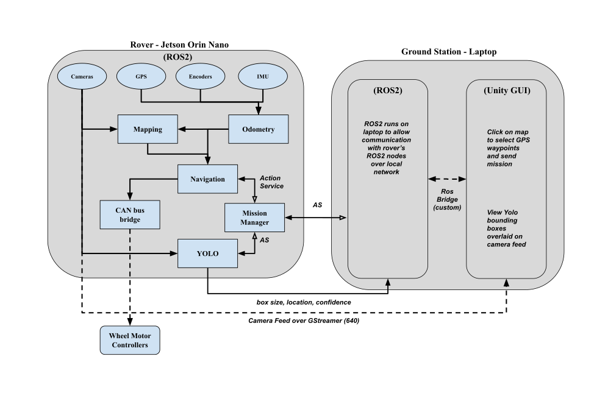

# Oregon State University Mars Rover Capstone (CS.005)

### DAM Robotics' Rover

### Groundstation (User Interface)

### Navigation System

## About The Project

### Project Description
We are developing an autonomous navigation system for the Mars Rover team at OSU to complete roving autonomy tasks for the University Rover Challenge (URC) and the Canadian International Rover Challenge (CIRC).

### Competition Navigation
The rover must autonomously navigate, a desert-style environment, to GPS waypoints and visually locate various objects at these sites. Systems include environment mapping, robot localization, navigation, obstacle avoidance, and object detection. Navigate safely to GNSS locations.

### Competition Searching
The rover will need to search and identify specific objects and ArUco markers autonomously. Some of these objects include an orange hammer and a water bottle.

## Key Features

### Robot Localization
**EKF Sensor Fusion.** To maintain a reliable global position, we use an Extended Kalman Filter (EKF) to combine three hardware sensors. A dual RTK-GPS setup provides centimeter-level global positioning. To smooth out the discrete update jumps of the GPS and account for the sliding of the drivetrain, the EKF fuses in high-frequency data from a 9-axis IMU and wheel odometry. This guarantees the rover maintains a continuous, precise location to guide navigation stack

### Naviation & Avoidance
**ROS 2 Nav2 & 3D Depth Mapping.** We implemented the ROS 2 Nav2 framework to handle autonomous pathing and reactive driving. For environmental awareness, we map 3D point cloud data from a Realsense depth camera to a 2D obstacle costmap. When an obstacle blocks the global path, the local planner continuously computes safe, collision-free trajectories to automatically route the rover around it to safely reach the destination.

### Mission Planning
**Operator-Defined Mission Planning.** Operators define GPS destinations, target objects, and geometric search patterns entirely through a custom Unity ground station interface. Once the mission is transmitted, an onboard state machine executes the search. This includes an active AI-interrupt loop: if the YOLO pipeline registers a high-confidence detection, the rover dynamically breaks its search grid and steers directly toward the target.

### Visual Object Perception
**YOLOv11 Edge-Computed Object Detection.** The rover uses a set of custom-trained YOLOv11 models running locally on the onboard Jetson to identify mission targets. To manage hardware compute limits, we multiplexed multiple camera feeds into a single inference stream. The pipeline calculates confidence scores in real-time before publishing the bounding boxes and video feed back to the operator's ground station.

## Architecture Overview

## Groundstation Setup

### Getting Started With Groundstation Code
This repo does not contain groundstation code. To view groundstation code and setup, see https://github.com/OSURoboticsClub/Rover-Unity

## Rover Setup

### Getting Started With Rover Code

We integrate 4 software environments to help manage our rover. These include:

ROS2 Humble - https://docs.ros.org/en/humble/index.html

Moveit2 - https://moveit.picknik.ai/main/index.html

Intel Realsense - https://github.com/IntelRealSense/librealsense

#### ROS2 and Moveit
ROS2 serves as our middleware communications manager between subsystems on the rover and between rover and groundstation. ROS2 also serves as a platform which Moveit2 operates on, acting as our IK and path planning solver and executioner for our 6-DOF arm. 

#### Intel Realsense
The realsense SDK provides libraries that help us interact with the Intel Realsense line of cameras. We use these on the rover to perform pointcloud construction and objection avoidance on the Rover. We also have one mounted on the gripper to allow for collision avoidance and planning for the arm.

### Miscellaneous
This code utilizes NVENC h.265 hardware acceleration for our cameras, powered by the Jetson line of Nvidia computers. This is the only hardware specific factor this code requires to run properly. Can also be fixed in appropriate files by changing from NVENC to standard H265ENC gstreamer functions.

Overall instillation and setup is very straight forward, just make sure to follow all instructional guides closely. 

## Team Credits
* Andrew Swartz
* Ryan Davidson
* Kylan Jagels
* Henry Dalrymple
* Siya Sonpatki
* Tanush Ojha
* Project Partner: Oregon State University's DAM Robotics Club

**Contact Us: Jagelsky@oregonstate.edu
